<h1 align="center">review-desk-axi</h1>
<p align="center">
  <a href="https://github.com/andyqioe/review-desk-axi/actions/workflows/ci.yml"
    ></a>
  <a href="https://github.com/andyqioe/review-desk-axi/actions/workflows/release-please.yml"
    ></a>
  <a href="#install"
    ></a>
  <a href="#install"
    ></a>
  <a href="#install"
    ></a>
  <a href="https://claude.com/claude-code"
    ></a>
</p>

<p align="center"><b>Review your agent's change in a real editor, with an AI reviewer that answers every question and never edits code.</b></p>

<p align="center">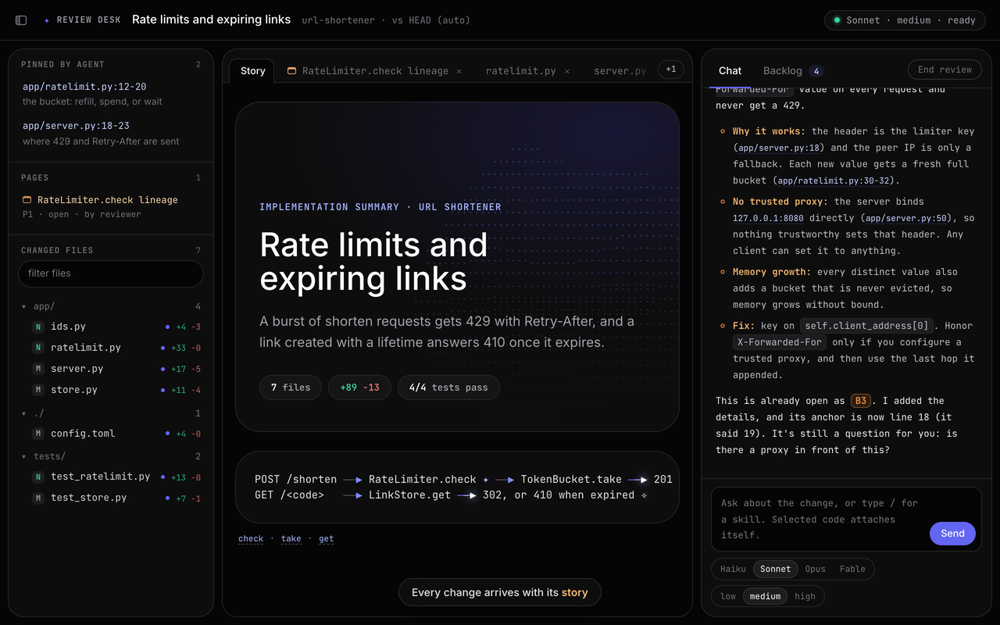</p>

A fast, local code review editor for changes made by a coding agent, staffed by a reviewer agent you can talk to.

You read the change in a real editor (changed-file tree, diff and file views, tabs, search) and ask questions in a chat panel.
A long-lived Claude reviewer answers with clickable `path:line` references.
The reviewer never edits code.
Everything that should change goes into a durable backlog, which reaches the main agent when you press Execute, when the review ends, or when the reviewer exits.

Review Desk is a [Claude Code](https://claude.com/claude-code) skill with an [AXI](https://axi.md) command-line interface, `review-desk-axi`, installed together with its two companion skills in one command.
It runs entirely on your machine: a small Python server on `127.0.0.1`, plain HTML/CSS/JS in the browser, and append-only files on disk.

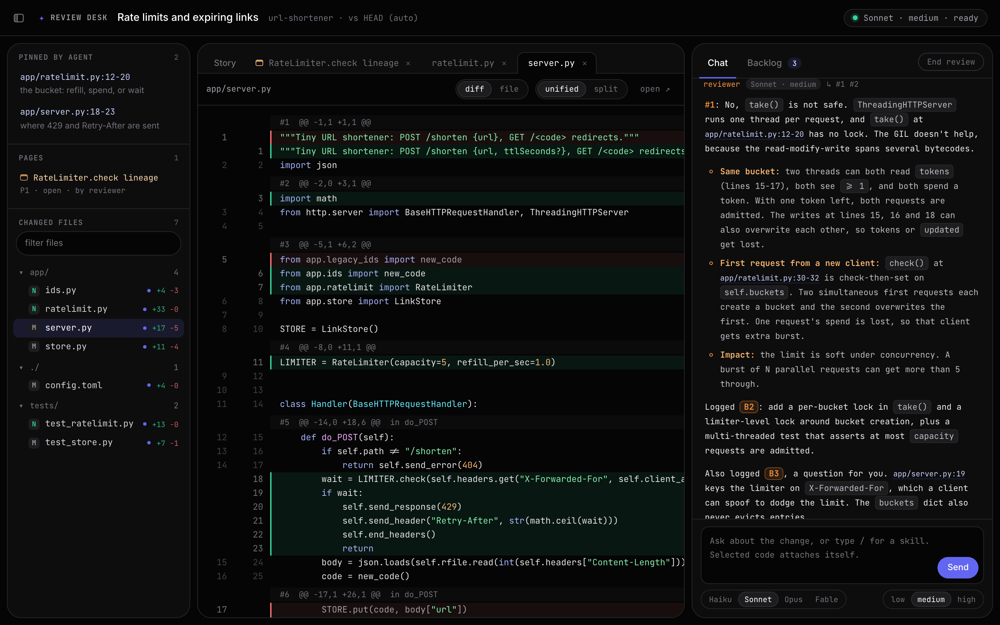

## Contents

- [Why](#why)
- [How a review flows](#how-a-review-flows)
- [Install](#install)
- [Quick start](#quick-start)
- [The editor](#the-editor)
- [The chat](#the-chat)
- [The backlog](#the-backlog)
- [Pages: HTML as read-only tabs](#pages-html-as-read-only-tabs)
- [Keyboard shortcuts](#keyboard-shortcuts)
- [The reviewer](#the-reviewer)
- [CLI reference](#cli-reference)
- [Durability and security](#durability-and-security)
- [Files](#files)
- [Tests and evals](#tests-and-evals)

## Why

An agent that just finished a change is a poor reviewer of it: its context is full, and every question you ask it costs the main session tokens and attention.
Reading a diff in the terminal loses the structure of the change, and a generic chat loses the code.

Review Desk splits the roles:

| Role | Does | Never |
|---|---|---|
| You (browser) | read, select lines, ask, flag, suggest edits, pick the reviewer's model and effort, press Execute or End | |
| Reviewer (one long-lived Claude session) | answers in the chat, logs real issues to the backlog, runs skills, makes pages | edits the repository |
| Main agent | opens the desk, pins the code to read first, implements backlog items, acks and closes them | answers chat questions while a reviewer is live |

The reviewer's model and effort switch in place from the chat, without a respawn and without losing the conversation.
Haiku for quick lookups, Opus when a question spans files.

## How a review flows

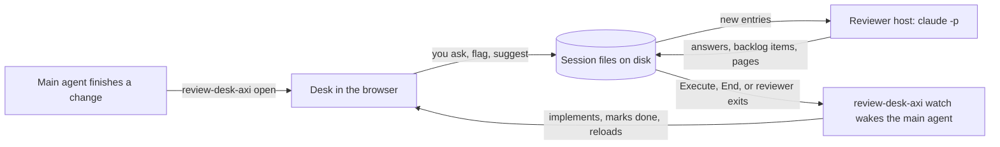

1. The main agent runs `review-desk-axi open`, pins the one to three places you should read first, and starts a reviewer at the model and effort you choose.
2. You read the change and talk to the reviewer.
   Every real issue becomes a backlog item (`B1`, `B2`, ...), with a file anchor and a suggested fix.
3. When you press **Execute**, the main agent wakes up (a background `review-desk-axi watch` returns), implements exactly the items you selected, marks each one done with a note, and reloads the desk.
   The reviewer keeps running with its context, ready for the next round.

When the change was made through the companion `/implementation-summary` skill, the desk also shows its animated summary page in the **Story** tab.

## Install

One command installs the whole bundle with the [skills CLI](https://www.npmjs.com/package/skills):

```bash
npx skills add andyqioe/review-desk-axi --skill '*' -g -a claude-code -y
```

| Skill | What it does |
|---|---|
| `review-desk` | the editor, the reviewer and the backlog described here |
| `implementation-summary` | after every change, a narrated summary with an animated page (the desk's **Story** tab), then opens the desk |
| `analyze-code` | `/analyze-code <target>`: call lineage, role, data flow and change impact, optionally as an HTML page with diagrams (the **Analyze code** button) |

Drop `-a claude-code` to choose other agents (Codex, Cursor and more), and drop `-g` to install into the current project only.
The first time Claude uses the desk it runs `review-desk-axi setup` (below) if the command is not on your `PATH` yet; you can also run it yourself:

```bash
~/.claude/skills/review-desk/bin/review-desk-axi setup
```

Requirements:

- Python 3.9 or newer (tested on 3.9, 3.13 and 3.14) and git.
- [Claude Code](https://claude.com/claude-code) for the reviewer (`claude` on `PATH`).
- A browser.
- Optional: [ripgrep](https://github.com/BurntSushi/ripgrep) for repository search (falls back to `git grep`).
- Optional: `sandbox-exec` (macOS, built in) or `bwrap` (Linux) for sandboxed page generators.

To work on the code instead, clone the repository and link the three skills:

```bash
git clone https://github.com/andyqioe/review-desk-axi ~/review-desk-axi
for s in review-desk implementation-summary analyze-code; do ln -s ~/review-desk-axi/skills/$s ~/.claude/skills/$s; done
```

`setup` is idempotent and reports each change:

- `bin` links `review-desk-axi` onto your `PATH` (default `/opt/homebrew/bin`; pass `--bin-dir ~/.local/bin` elsewhere).
- `agents` writes the subagent fallback reviewers (`~/.claude/agents/review-desk-{low,medium,high}.md`).
- `hooks` adds four hooks to `~/.claude/settings.json`, plus a permission for `review-desk-axi`:
  SessionStart prints a home view of this repository's sessions;
  UserPromptSubmit injects backlog that never reached the main agent;
  PostToolUse and Stop hand an Execute or End to the agent that opened the desk, after its next tool call or before it stops.

Run `setup hooks`, `setup bin` or `setup agents` for one part.

## Quick start

In Claude Code, ask for it in plain words ("open the review desk", "review the changes with me"), or run it yourself on any git repository:

```bash
review-desk-axi open --title "Rate limits and expiring links" --repo .
review-desk-axi add <sid> app/ratelimit.py:12-20 --note "the bucket: refill, spend, or wait"
review-desk-axi reviewer <sid> start --model sonnet --effort medium
review-desk-axi watch <sid>      # blocks until Execute, End, or the reviewer exits
```

`open` prints the session id and URL and opens the browser once.
Without a manifest from `/implementation-summary`, the desk computes the change from `git diff` against `HEAD` (or `--base`, scoped with `--paths`), including untracked files.

## The editor

### Changed files, diffs and tabs

The left panel lists every changed file by folder, with its status (`M`, `N`, `D`, renamed) and line counts.
Files the agent pinned appear on top under **pinned by agent**, each with a note on why to read it first.
Drag the panel borders to resize them; Cmd/Ctrl+B hides the files panel.

Each file opens as a tab in **diff** or **file** view, and diffs show **unified** or **split**.
A line outside every hunk opens in the whole-file view at that line.
Code is highlighted with highlight.js, and long sessions stay fast: diffs are fetched per file and cached.

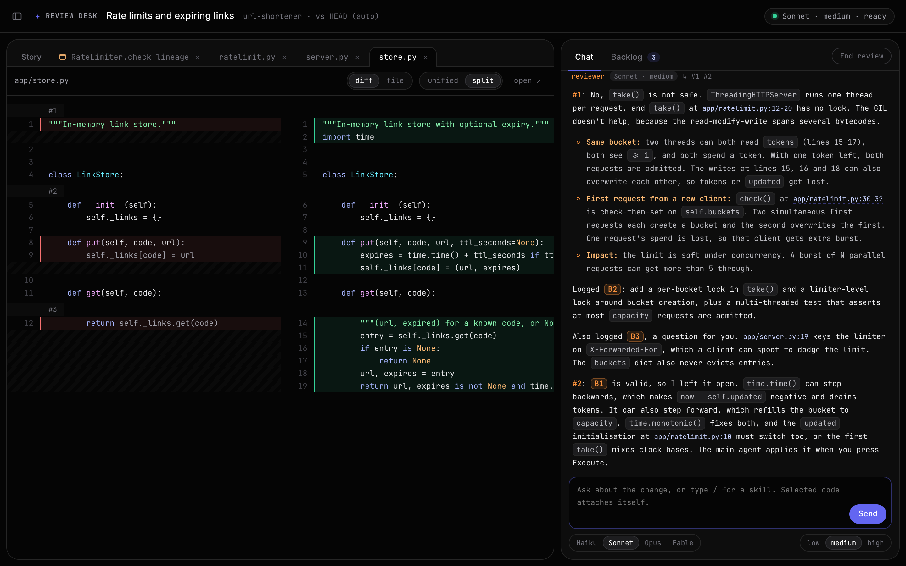

The tab strip never wraps or scrolls vertically.
When tabs overflow, the hidden edge fades, the mouse wheel scrolls the strip sideways, the active tab stays in view, and a **+N** button lists every open tab.
Drag a tab to reorder it (Story stays first), or use Alt+Shift+←/→.
Drop a file from the tree onto the strip to open it at that position.

### Select, analyze, flag, suggest

Select lines by dragging across the line numbers (Shift+click extends), or by selecting text.
The selection follows you into the chat as a live chip, `[app/server.py@18-23]`, so the next question carries the exact lines.
A small bar offers **Analyze code**, which runs the `/analyze-code` skill on those lines, and **Flag / edit**.

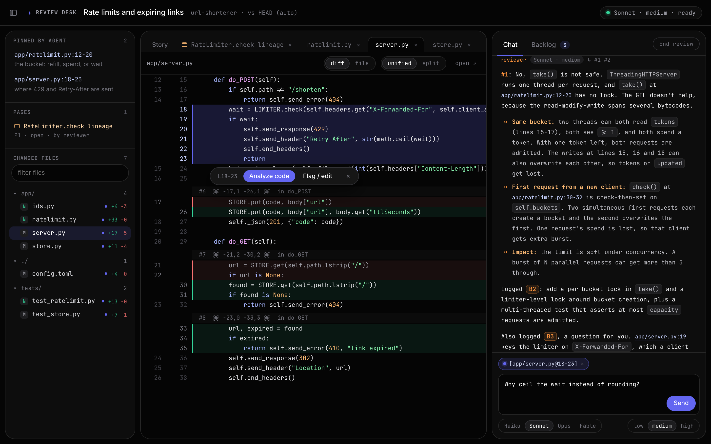

**Flag / edit** opens an inline panel under the selection with the lines in an editable, highlighted editor.
Leave them as they are to flag the lines, or edit them to suggest a change.
Either way it becomes a backlog item; a suggested edit carries a real unified diff that the main agent applies.

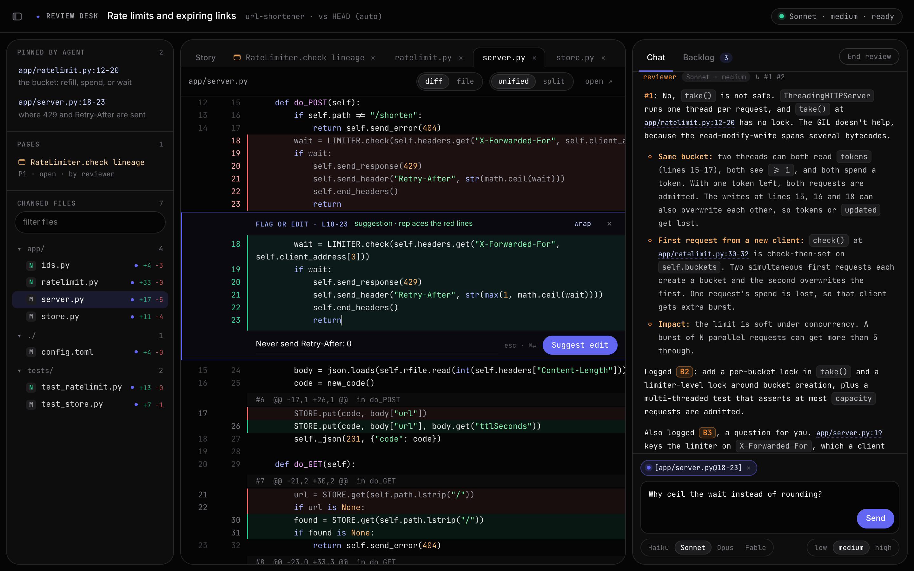

### Find in the file (Cmd+F)

A floating find bar searches what the pane shows (the diff, the split halves, or the whole file).
It has match case, whole word and regex toggles (Alt+C, Alt+W, Alt+R), a "2 of 6" counter, and ticks on the right edge that show where the matches are.
Matches are painted with the CSS Custom Highlight API, so they cross syntax-highlighting spans without changing the DOM.

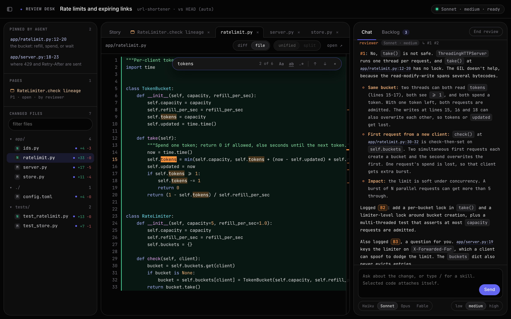

### Search the repository (Cmd+Shift+F)

A search panel in the style of the biggrep VS Code extension opens from anywhere in the desk, including the chat, the Story tab and page tabs.

- **Scope:** the change set by default, or the whole repository (Alt+S), as git sees it: hidden files included, ignored files left out.
- **Query:** case-insensitive by default, with match case, whole word and regex toggles.
- **Path filter:** tokens such as `src/` (substring), `*.py` (glob) and `!test` or `-test` (exclude).
- **Results:** stream in as ripgrep finds them, grouped by file with change badges, syntax-highlighted, with matches marked.
- **Keys:** ↓ enters the list, j/k and PgUp/PgDn move, ←/→ fold a file, Space previews, Enter opens the match at its line and carries the query into the file's find bar, Cmd+C copies `path:line:text`, Esc closes.

Each keystroke cancels the previous query, and old results stay until the new ones arrive, so typing never flashes stale or empty lists.
A query stops at 2000 matches and says so.

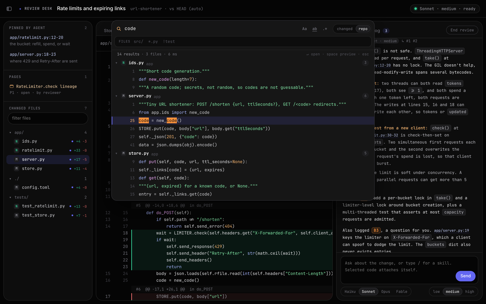

## The chat

Ask anything about the change.
The reviewer answers in Markdown with `path:line` links that open in the editor, and the answer streams in as it is written.
Text hierarchy carries the structure: the lead is brightest, bullets a shade dimmer, metadata dimmest, and orange marks emphasis (bold labels, backlog ids like `B2`, entry references like `#1`).

Type `/` for a skill.
The menu lists the skills installed in `~/.claude/skills`; the reviewer runs the one you pick, with your selected lines as its target, and condenses the result into the chat.

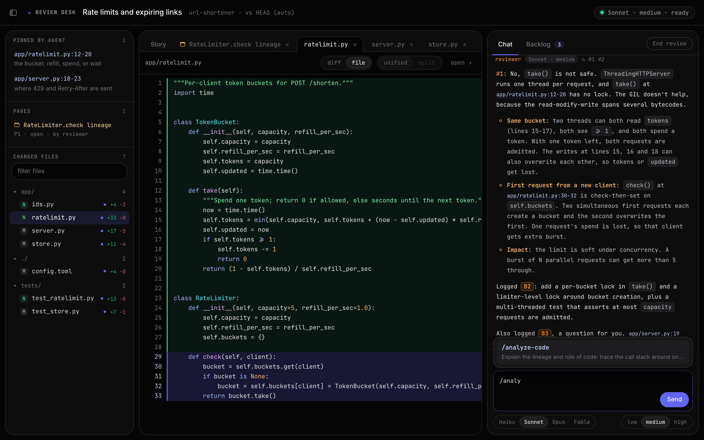

The chips under the composer pick the reviewer's model (Haiku, Sonnet, Opus, Fable) and effort (low, medium, high).
A change applies to your next message, in the same reviewer session.

## The backlog

Every flag, suggested edit and issue the reviewer logs is a backlog item with an id, a kind (`fix`, `suggested-edit`, `question`), an anchor and a detail.
Select items and press **Execute selected**, or **Execute all open**; you can also dismiss and reopen them.
The main agent marks each item done with a note naming what changed, and the desk reloads its diffs.

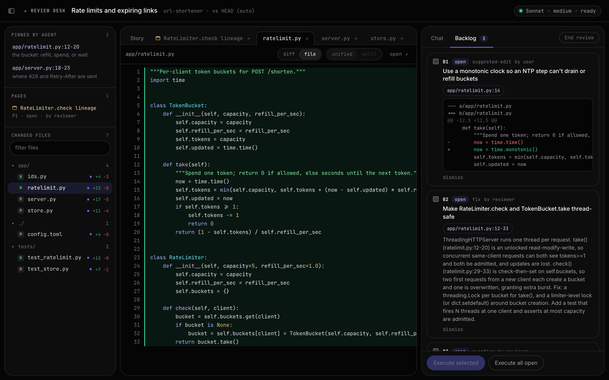

Delivery is durable.
An item reaches the main agent on Execute, on End, when the reviewer exits, or, failing all three, through the UserPromptSubmit hook the next time you talk to the main agent.
It is delivered again until the main agent acknowledges it with `backlog <sid> ack`.

## Pages: HTML as read-only tabs

Any HTML page opens as a read-only tab beside the code: a diagram the reviewer drew, a skill's `--html` output (for example `/analyze-code --html`), or an implementation summary.
The reviewer, the main agent and you can all open and close them, and the state is saved, so everyone sees the same tabs after a reload.

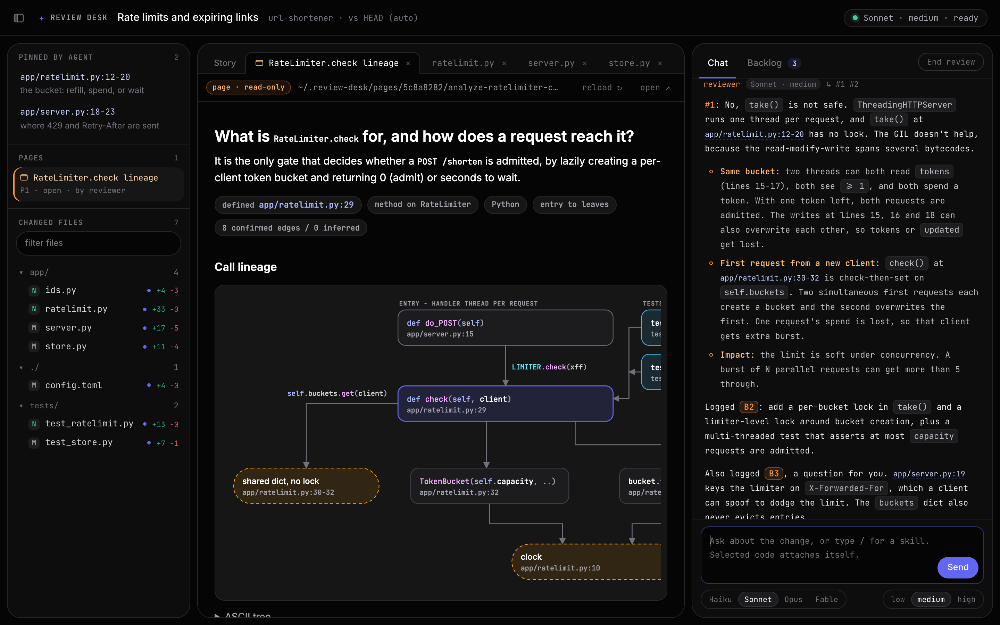

- **Agents:** `review-desk-axi page <sid> open <file.html> [--title T]` (ids `P1`, `P2`, ...; reopening reuses the id), `page <sid> close P1`, `page <sid> list`.
- **You:** close a tab with its ×, reopen it from **pages** in the files panel, click any `.html` path in the chat, or use **render as page** on an HTML file from the repository.
- **Live:** editing a page's file reloads its open tab.
- **Links:** `vscode://file/...:line` links and `path:line` chips inside a page open in the desk's editor; a modifier-click keeps the page's own action.
- **Sandboxed:** pages render in a sandboxed iframe with an opaque origin, enforced again by a CSP header.
  Their scripts run, but cannot reach the desk's token, its API or its storage.
  They are served with a separate read-only key, and only from their own folder.

The **Story** tab is the change's implementation summary, when the session came from `/implementation-summary`: an animated page with the shape of the change, code excerpts and every changed file.
Its links open in the desk too.

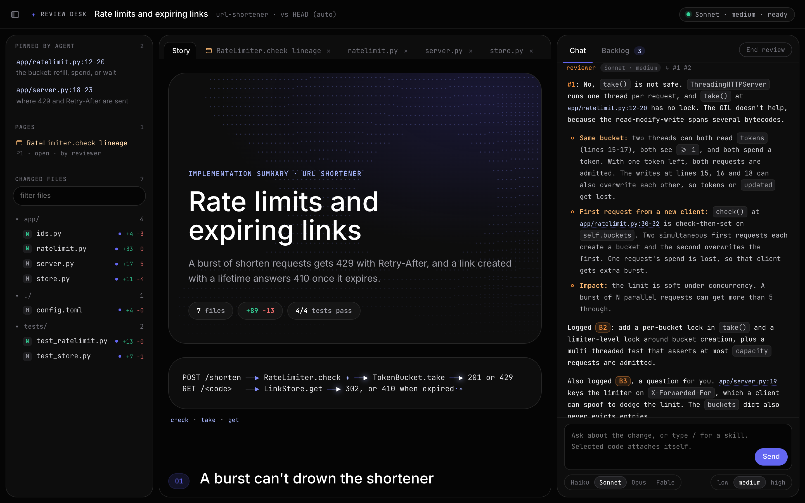

The reviewer writes pages into `~/.review-desk/pages/<sid>/`, its only writable folder.
Skills that build pages with a script (analyze-code's figure generator, for one) run through `review-desk-axi run <sid> -- python3 make_page.py`, which confines every write to that folder with `sandbox-exec` on macOS or `bwrap` on Linux.

## Keyboard shortcuts

| Keys | Where | Does |
|---|---|---|
| Cmd/Ctrl+Shift+F | anywhere | search the repository |
| Cmd/Ctrl+F | code tab | find in the file |
| Enter, Shift+Enter | find bar | next, previous match |
| Cmd/Ctrl+G, F3 | after a find | next match (Shift for previous) |
| Alt+C, Alt+W, Alt+R | find and search | match case, whole word, regex |
| Alt+S | search | changed files or whole repository |
| ↓, j/k, PgUp/PgDn, Home/End | search results | move |
| ←, → | search results | fold, unfold a file |
| Enter, Space | search results | open, preview |
| Cmd/Ctrl+B | anywhere | hide or show the files panel |
| Alt+Shift+←/→ | focused tab | move the tab |
| Delete, middle-click | tab | close the tab |
| Enter (Shift+Enter for a newline) | composer | send |
| ↑/↓, Tab or Enter | slash menu | pick a skill |
| Cmd/Ctrl+Enter, Tab | inline edit | submit, indent |
| Esc | anywhere | close the open panel, clear the selection |

## The reviewer

The reviewer is one long-lived `claude -p` session per review (`scripts/reviewer_host.py`), fed from the session files with stream-json input and output.

- **Live tier switches:** picking another model or effort sends `set_model` and an `effortLevel` settings change to the same process.
  The conversation is kept, and `reviewer <sid> start` resumes it after a restart.
- **Streaming:** partial messages are written to `stream.json`, and the desk renders them as they arrive.
- **Read-only by construction:** its tools are Read, Grep, Glob, Skill and `review-desk-axi` itself, plus `git diff` and `git log`.
  Write and Edit are allowed only inside its pages folder; any other write would need an approval nobody can give in `-p` mode, so it is denied.
- **Instructions:** `agents/host-reviewer.md` holds its rules: lead with the answer, cite `path:line`, log every real issue before mentioning it, answer every entry by number, and turn change requests into backlog work.

When `claude` cannot run headless, a background subagent can play the reviewer instead (`review-desk-<effort>` agents from `setup agents`, or `review-desk-axi prompt` for a general-purpose agent).
A subagent cannot change model, so it hands over (`HANDOFF tier=M/E`) and the main agent respawns the new tier.
Without any reviewer, the main agent can answer in the desk itself: `attach <sid> --main`, then `wait`, `reply` and `backlog add`.

## CLI reference

Run `review-desk-axi` with no arguments for the home view: this repository's sessions and any undelivered backlog.
Output is TOON with a `help[]` block naming the next command; errors print `error:` on stdout and exit 1 (usage errors 2); every write is safe to retry.
Every command except `open` and `url` works with the server down, because disk is the source of truth.

**Main agent**

| Command | Does |
|---|---|
| `open --title T [--dir D] [--page P] [--summary S] [--notes N] [--repo R] [--base B] [--paths ...]` | create or reuse a session and open the desk |
| `add <sid> <path[:a-b]>... [--note N] [--focus]` | pin files or ranges into the editor |
| `reviewer <sid> start\|stop\|status [--model M --effort E]` | run the reviewer host |
| `watch <sid>` | block until Execute, End or the reviewer exits (run it in the background) |
| `handoff <sid>` | backlog the main agent has not accepted yet |
| `backlog <sid> ack\|done\|dismiss\|reopen <ids> [--note N]` | track and close items |
| `page <sid> open <file.html> [--title T] [--background]`, `close <id>`, `list` | HTML pages as read-only tabs |
| `run <sid> -- <command...>` | run a page generator with writes confined to the pages folder |
| `reload <sid> [--page P]` | refresh the browser after a rebuild; recompute git diffs |
| `status <sid>`, `url <sid>`, `end <sid>`, `prefs [--model M --effort E]` | inspect, reopen, close, set defaults |
| `setup [hooks\|bin\|agents\|all]` | install the hooks, the PATH link and the fallback agents |

**Reviewer**

| Command | Does |
|---|---|
| `attach <sid> --model M --effort E [--main]` | briefing: context, chat, backlog, pending messages |
| `wait <sid> [--timeout 540]` | block for the next user entries |
| `reply <sid> --to 4,5 --file - [--then-wait]` | answer in the chat (Markdown on stdin) |
| `backlog <sid> add --title T --detail D --anchor path:a-b --from SEQ [--kind fix\|question]` | log an issue |
| `backlog <sid> list [--fields a,b] [--full] [--all]`, `update <id> ...` | read and refine the backlog |
| `chat <sid> [seq...] [--last N] [--full]` | read messages in full |
| `detach <sid> --reason handoff\|execute\|idle\|end` | end a subagent reviewer run |

`--home <dir>` (or `REVIEW_DESK_HOME`) selects an isolated session store; its `config.json` may pin a port and disable the browser, as in `{"port": 4401, "no_open": true}`.

## Durability and security

**Durability.**
A session is a directory of append-only JSONL files.
Every append happens under an `flock` and ends with `fsync`, and readers skip a torn last line, so killing any process at any instant loses at most the line being written.
The browser, the reviewer and the main agent all read and write those files, so a dead server never blocks the reviewer and a killed reviewer never loses what it logged.
The test suite proves it with `kill -9` in the middle of a write loop.

**Security.**

- The server binds to `127.0.0.1` only and exits after 30 idle minutes.
- Every API call needs the session's random token; POSTs from another origin are refused.
- File reads are confined to the repository; pages are confined to their own folder, refuse dotfiles, and get a separate read-only key.
- Pages run in a sandboxed opaque origin, so their scripts cannot act as you in the desk.
- The reviewer cannot write to the repository; page generators run under an OS write sandbox.

## Files

```text
skills/review-desk/                     the desk (this README)
  SKILL.md                              the skill's instructions for Claude Code
  bin/review-desk-axi                   CLI entry (setup bin links it onto PATH)
  scripts/review_desk.py                the CLI: every command above
  scripts/axi.py                        TOON output, help blocks and structured errors
  scripts/store.py                      session files, fsync'd appends, backlog and page folds, presence
  scripts/server.py                     loopback HTTP server: the desk, the API, SSE, search, pages
  scripts/search.py                     Cmd+Shift+F engine: ripgrep (or git grep), path filter, previews
  scripts/reviewer_host.py              the long-lived claude -p reviewer, in-place model and effort switches
  scripts/gitdiff.py                    review data from plain git diff when no manifest exists
  scripts/install_agents.py             writes the fallback reviewer agents from agents/reviewer.md.tmpl
  agents/host-reviewer.md               the reviewer host's instructions
  assets/desk.{html,css,js}             the editor; no build step
  tests/                                end-to-end tests: real server, real CLI, real git repo, kill -9
  evals/                                task evals for the main agent, the reviewer and the live host
skills/implementation-summary/          change map, narrated summary, animated page, desk hand-off
skills/analyze-code/                    call lineage analysis, figure generator and a worked example
.github/workflows/                      CI on macOS and Linux, release-please
```

A session directory holds `session.json`, `context.md` (the reviewer's briefing), `manifest.json` and `diffs/`, and the append-only `chat.jsonl`, `backlog.jsonl`, `tray.jsonl` and `pages.jsonl`.
The session store defaults to `~/.review-desk/`.

## Tests and evals

```bash
cd skills/review-desk
python3 -m unittest discover -s tests       # end-to-end suite
python3 -m unittest evals/test_harness.py   # proves every eval discriminates
cd ../implementation-summary
python3 -m unittest discover -s tests       # change model and page builder
```

CI runs all of it on Linux (Python 3.9 and 3.13) and macOS on every push, and builds analyze-code's worked example to check it has no layout warnings.

The end-to-end suite runs a real server, the real CLI and a real git repository.
It covers the protocol, the AXI output contract, idempotent writes, token and origin checks, `kill -9` durability, the reviewer host with a fake `claude`, pages and their sandbox, and search.

`evals/` holds eleven task evals for the main agent, the subagent reviewer and the live reviewer host, plus trigger queries.
A harness seeds a session in an isolated home, plays the user, and grades from the session files, never from a transcript; see [`skills/review-desk/evals/README.md`](skills/review-desk/evals/README.md).
